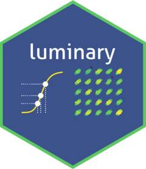

# luminary 

An R package for importing and working with Luminex data acquired using the xMAP INTELLIFLEX instrument.

## Code of Conduct

Please note that the luminary project is released with a [Contributor Code of Conduct](https://contributor-covenant.org/version/2/1/CODE_OF_CONDUCT.html). By contributing to this project, you agree to abide by its terms.

